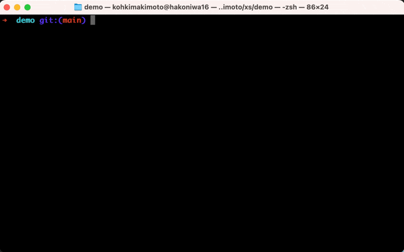

# XS

[](https://github.com/kohkimakimoto/xs/actions/workflows/test.yml)

XS is a SSH command wrapper that enhances your SSH operations.

## Overview

XS is used in the same manner as the `ssh` command, so you can use it as a drop-in replacement for the `ssh` command.
If you use the `ssh` command like this:

```sh
ssh [options] [user@]hostname [command]
```

You can use the `xs` command like this:

```
xs [options] [user@]hostname [command]
```

XS is a wrapper for the `ssh` command, so it internally runs the `ssh` command while adding useful features.
Here are some features XS offers:

- **Configuration by Lua script**: You can define configuration in [Lua](https://www.lua.org/manual/5.1/) script that produces the ssh_config (usually `~/.ssh/config`) file. See [Configuration](#configuration) for more details.
- **Zsh completion**: XS supports zsh-completion. See [Zsh Completion](#zsh-completion) for more details.
- **Hooks**: XS supports hooks. Hooks execute arbitrary commands before and after the SSH connection. See [Hooks](#hooks) for more details.

### Demo

I implemented a demo to show XS functionalities. You can see the configration of the following demo in the [demo](./demo) directory.

#### Zsh Completion and Change Terminal Color



#### Transfer dotfiles by SSHRC module


## Installation

XS is provided as a single binary command `xs`. You can download it and drop it in your $PATH.

[Download the latest version](https://github.com/kohkimakimoto/xs/releases/latest)

## Configuration

XS reads configuration from `~/.xs/config.lua`. The configuration file is written in Lua. The following is an example of the configuration file.

```lua
host "your-remote-server1" {
  description = "remote server1",
  ssh_config = {
    HostName = "192.168.0.11",
    Port = "22",
    User = "kohkimakimoto",
    -- You can specify any ssh options here.
  }
}

host "your-remote-server2" {
  description = "remote server2",
  ssh_config = {
    HostName = "192.168.0.12",
    -- ...
  }
}
```

The above configuration produces the following ssh_config and uses it when connecting to the remote server.

```
Host your-remote-server1
    HostName 192.168.0.11
    Port 22
    User kohkimakimoto

Host your-remote-server2
    HostName 192.168.0.12
    # ...
```

Internally, XS generates a temporary ssh_config file and uses it by passing the `-F` option to the `ssh` command.

```sh
xs your-remote-server1
# XS runs the following command internally:
# => ssh -F /var/folders/dy/xxx/T/xs.ssh_config.xxx.tmp your-remote-server1
```

### Hosts

Hosts in XS are your managed remote servers. They generate the "Host" sections in the ssh_config file and define additional functionalities supported by XS.
Hosts are defined by the `host` function. The first argument is the host name, and the second argument is a table that contains the host parameters.

#### Syntax

```
host <hostname (string)> <parameters (table)>
```

#### Example

```lua
host "your-remote-server1" {
  description = "remote server1",
  hidden = false,
  ssh_config = {
    HostName = "192.168.0.11",
    Port = "22",
    User = "kohkimakimoto",
    -- You can specify any ssh options here.
  },
  on_before_connect = {
    -- Hooks to execute before connecting to the host.
  },
  on_after_connect = {
    -- Hooks to execute after connecting to the host.
  },
  on_after_disconnect = {
    -- Hooks to execute after disconnecting from the host.
  },
}
```

#### Parameters

* `description` (string): A description of the host. This is used in the [`xs list`](#xs-list) command and [Zsh Completion](#zsh-completion) to display the host description.

* `hidden` (boolean): If `true`, the host is hidden from the [`xs list`](#xs-list) command and [Zsh Completion](#zsh-completion). The default is `false`.

* `ssh_config`(table): A table that contains the ssh_config parameters. The keys are the same as the ssh_config parameters. You can specify any ssh options here.

* `on_before_connect` (array table): Hooks to execute commands before connecting to the host. See [Hooks](#hooks) for more details.

* `on_after_connect` (array table): Hooks to execute commands after connecting to the host. See [Hooks](#hooks) for more details.

* `on_after_disconnect` (array table): Hooks to execute commands after disconnecting from the host. See [Hooks](#hooks) for more details.

### Hooks

Hooks in XS are mechanisms to execute arbitrary commands before and after the SSH connection.
There are three types of hooks `on_before_connect`, `on_after_connect`, and `on_after_disconnect` to apply to the host.
Each hook is an array table of strings or lua functions.

See the following example:

```lua
host "your-remote-server1" {
  -- configurations of the host...

  on_before_connect = {
    -- You can specify a string as a shell command.
    "echo 'example on_before_connect hook (string)'",

    -- You can specify a lua function.
    -- Because XS needs to evaluate the function to get the return value, the function is executed before any hook specified as a string.
    function()
      -- You can write any lua code here.
      print("example on_before_connect hook (lua function)")

      -- If you return a string, it will be executed as a shell command.
      return "echo 'example on_before_connect hook (return value)'"
    end

    -- You can add more shell commands or lua functions here.
  },
}
```

When you connect to the host, XS executes the hooks in the following order:

```sh
$ xs your-remote-server1
example on_before_connect hook (lua function)
example on_before_connect hook (string)
example on_before_connect hook (return value)
# after the "on_before_connect" hook process, XS connects to the host.
```

> :exclamation: Hooks are executed only when you use XS without any command just like `xs your-remote-server1`. If you specify a command like `xs your-remote-server1 ls`, XS does not execute any hooks.

For more information. See the following description of each hook.

#### `on_before_connect`

It is a hook executed before connecting to the host.
This hook runs on your local machine before the SSH connection is established.

#### `on_after_connect`

It is a hook executed after connecting to the host.
It is a "remote hook" that runs on a remote machine after the SSH connection has been established.
However, if you specify a Lua function, it will still be executed on your local machine because any Lua code is evaluated by XS running on your local machine.

#### `on_after_disconnect`

It is a hook executed after disconnecting from the host.
This hook runs on your local machine after the SSH connection is closed.

## Lua VM

XS uses [GopherLua](https://github.com/yuin/gopher-lua) as the Lua VM to parse the configuration.
The Lua VM is customized for XS.

### `xs` Global Variable

XS provides predefined `xs` global variable. It is a table that contains the following properties:

- `config_file`: The path to the configuration file.

- `config_dir`: The directory where the configuration file is located.

#### Usage

```lua
print(xs.config_file) -- => ex: /Users/kohkimakimoto/.xs/config.lua
print(xs.config_dir)  -- => ex: /Users/kohkimakimoto/.xs
```

### Built-in Modules

XS also provides some additional built-in modules to write configuration (especially useful for writing hooks).

#### `xs.shell`

This module provides functions to execute shell commands.

##### Usage

```lua
local shell = require "xs.shell"

local result = shell.run("echo hello")
result:exit_status()     -- => 0
result:success()         -- => true
result:failure()         -- => false
result:stdout()          -- => "hello\n"
result:stderr()          -- => ""
result:combined_output() -- => "hello\n"
```

#### `xs.template`

This module provides a simple templating feature.
It is based on the [Go Text Template](https://pkg.go.dev/text/template).

##### Usage

```lua
local template = require "xs.template"

template.dostring([[
This is a text template library.
Created by {{.first_name}} {{.last_name}}
]], { first_name = "kohki", last_name = "makimoto" })

-- Output:
-- This is a text template library.
-- Created by kohki makimoto

-- You can also use the template file like this.
template.dofile("path/to/template.txt", { first_name = "kohki", last_name = "makimoto" })
```

#### `xs.debuglogger`

This module provides a logger that outputs debug logs.
The debug logger outputs only when the [`XS_DEBUG`](#xs_debug) environment variable is set to `true`.

##### Usage

```lua
local debuglogger = require "xs.debuglogger"

debuglogger.printf("This is a debug message")
-- => [debug] This is a debug message

debuglogger.printf_no_prefix("This is a debug message")
-- => This is a debug message
```

### package.path

XS automatically adds the directory where the configuration file is located to the Lua [package path](https://www.lua.org/manual/5.1/manual.html#pdf-package.path),
so you can use `require` to load Lua modules in the same directory as the configuration file.

For example, if you have a Lua module `mylib.lua` in the same directory as the configuration file, you can load it like this:

```lua
local mylib = require "mylib"
```

## Official Lua Modules (Reusable Hooks)

I implemented some Lua modules for XS. See [ext](./ext) directory. These modules provide useful [hooks](#hooks) for XS.

- [terminal_profile](./ext/terminal_profile.lua): A module that provides a hook for `on_before_connect` and `on_after_disconnect` to change the macOS terminal profile.
- [sshrc](./ext/sshrc.lua): A module that provides a hook for `on_after_connect` to implement SSHRC functionality, allowing you to transfer your local `.sshrc` file to the remote server.

You can use these modules by copying them into the same directory as the configuration file and loading them with `require`.
For more details, see the comments in the Lua module file.

Yon can also see the demo that uses these modules. See [Demo](#demo).

## Zsh Completion

XS supports zsh completion. If you want to use it, add the following code in your `~/.zshrc`.

```sh
eval "$(xs zsh-completion)"
```

## Built-in Commands

XS provides some built-in commands to manage hosts.

### `xs list`

List defined hosts.

```sh
$ xs list
Host                  Description      Hidden
your-remote-server1   remote server1   false
your-remote-server2   remote server1   false
```

### `xs ssh-config`

Output ssh_config to STDOUT.

```sh
$ xs ssh-config
# The configuration is generated by xs with the config file: /Users/kohkimakimoto/.xs/config.lua

Host your-remote-server1
    HostName 192.168.0.11
    Port 22
    User kohkimakimoto

Host your-remote-server2
    HostName 192.168.0.12
    Port 22
    User kohkimakimoto

```

### `xs zsh-completion`

Output zsh completion script to STDOUT.

```sh
$ xs zsh-completion
# This is a zsh completion script for xs
# If you want to use this script, add the following line to your .zshrc
# ----------------------------------
# eval "$(xs zsh-completion)"
# ----------------------------------

# ...(zh completion script)...
```

## Environment Variables

You can change the default behavior of XS by setting the following environment variables.

### `XS_CONFIG`

Path to the configuration file. Default is `~/.xs/config.lua`.

### `XS_DEBUG`

If set to "true", XS will output debug information.

### `XS_NO_COLOR`

If set to "true", XS will not output color codes in debug information.

## Another Similar Tool

[ESSH](https://github.com/kohkimakimoto/essh) is a tool similar to XS, created by the same author a long time ago.
ESSH has many complex features to support various use cases, such as parallel execution and task definition, which can make it a bit complicated to understand and use.

XS is a newer tool that is simpler and more focused on standard SSH operations.
If you need parallel execution or task management, you should consider writing a shell script or something similar using XS.

## Author

Kohki Makimoto <kohki.makimoto@gmail.com>

## License

The MIT License (MIT)

